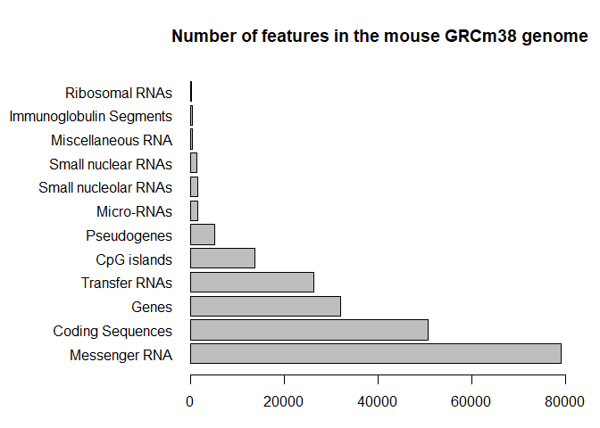

Class 05 Bimm 143
================
Khoi Tran
April 16, 2019

``` r
#Class 5 R graphics

#2A Line Plot
Weight <- read.table("bimm143_05_rstats/weight_chart.txt", header = TRUE)
plot(Weight$Age,Weight$Weight, 
    typ="o", pch=15, cex = 1.5, lwd=2,ylim=c(2,10), 
     xlab = "Age (months)",ylab="Weight(kg)",main="Weight vs Age in Babies")
```


``` r
#Barplot
par(mar=c(3.1, 11.1, 4.1, 2))
feat <- read.table("bimm143_05_rstats/feature_counts.txt", sep = "\t", header = TRUE)
barplot(feat$Count, names.arg = feat$Feature,
        horiz = TRUE, las=1, xlim = c(0,80000), main= " Number of features in the mouse GRCm38 genome")
```



``` r
#learn this margin manipulation


# Section 3
#Preset for certian file types
par(mar= c(7, 6, 4.1, 4))
counts <- read.delim("bimm143_05_rstats/male_female_counts.txt")
barplot(counts$Count, names.arg = counts$Sample, las=2,
        col=c(topo.colors(10)))
```


