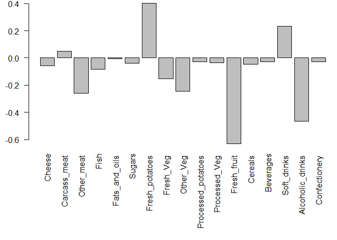

Class08
================
Khoi Tran
April 25, 2019

``` r
# K-means clustering
```

``` r
tmp <- c(rnorm(30,-3), rnorm(30,3))
x <- cbind(x=tmp, y=rev(tmp))
plot(x)
```


``` r
km<-kmeans(x,2,20)
km
```

    ## K-means clustering with 2 clusters of sizes 30, 30
    ## 
    ## Cluster means:
    ##           x         y
    ## 1  3.032499 -3.229160
    ## 2 -3.229160  3.032499
    ## 
    ## Clustering vector:
    ##  [1] 2 2 2 2 2 2 2 2 2 2 2 2 2 2 2 2 2 2 2 2 2 2 2 2 2 2 2 2 2 2 1 1 1 1 1
    ## [36] 1 1 1 1 1 1 1 1 1 1 1 1 1 1 1 1 1 1 1 1 1 1 1 1 1
    ## 
    ## Within cluster sum of squares by cluster:
    ## [1] 67.76355 67.76355
    ##  (between_SS / total_SS =  89.7 %)
    ## 
    ## Available components:
    ## 
    ## [1] "cluster"      "centers"      "totss"        "withinss"    
    ## [5] "tot.withinss" "betweenss"    "size"         "iter"        
    ## [9] "ifault"

``` r
km$size
```

    ## [1] 30 30

``` r
km$cluster
```

    ##  [1] 2 2 2 2 2 2 2 2 2 2 2 2 2 2 2 2 2 2 2 2 2 2 2 2 2 2 2 2 2 2 1 1 1 1 1
    ## [36] 1 1 1 1 1 1 1 1 1 1 1 1 1 1 1 1 1 1 1 1 1 1 1 1 1

``` r
km$centers
```

    ##           x         y
    ## 1  3.032499 -3.229160
    ## 2 -3.229160  3.032499

``` r
plot(x,col=km$cluster)
points(km$centers, pch=18, col="green", cex = 3)
```


``` r
#Hierarchical Clustering
Distance <- dist(x)
HCluster <- hclust(Distance)
plot(HCluster)
```


``` r
cutree(HCluster, k=2)
```

    ##  [1] 1 1 1 1 1 1 1 1 1 1 1 1 1 1 1 1 1 1 1 1 1 1 1 1 1 1 1 1 1 1 2 2 2 2 2
    ## [36] 2 2 2 2 2 2 2 2 2 2 2 2 2 2 2 2 2 2 2 2 2 2 2 2 2

``` r
plot(HCluster, h=6)
```


``` r
cutree(HCluster, h=2)
```

    ##  [1]  1  1  2  3  4  2  5  5  2  6  2  1  6  4  7  7  6  7  1  7  6  5  4
    ## [24]  6  2  3  6  2  4  6  8  9 10  8 11 10  8  9 12  8 13 14 13  8 13 13
    ## [47]  9  8 14 10  8 10 12 12 10  9 11 10 14 14

``` r
x <- rbind(
 matrix(rnorm(100, mean=0, sd = 0.3), ncol = 2), # c1
 matrix(rnorm(100, mean = 1, sd = 0.3), ncol = 2), # c2
 matrix(c(rnorm(50, mean = 1, sd = 0.3), # c3
 rnorm(50, mean = 0, sd = 0.3)), ncol = 2))
colnames(x) <- c("x", "y")
plot(x)
```


``` r
col<- as.factor(rep(c("c1","C2","c3")))
plot(x, col=col)
```


``` r
#PCA Principal Component Analysis
## You can also download this file from the class website!
mydata <- read.csv("https://tinyurl.com/expression-CSV",
 row.names=1) 
colnames(mydata)
```

    ##  [1] "wt1" "wt2" "wt3" "wt4" "wt5" "ko1" "ko2" "ko3" "ko4" "ko5"

``` r
pca<-prcomp(t(mydata))
plot(pca$x[,1],pca$x[,2],ylab = "hi")
```


``` r
pca.var <- pca$sdev^2
pca.var.per <- round(pca.var/sum(pca.var)*100, 1)
pca.var <- pca$sdev^2
pca.var.per <- round(pca.var/sum(pca.var)*100, 1)

barplot(pca.var.per, main="Scree Plot",
 xlab="Principal Component", ylab="Percent Variation")
```


``` r
colvec <- colnames(mydata)
colvec[grep("wt", colvec)] <- "red"
colvec[grep("ko", colvec)] <- "blue"
plot(pca$x[,1], pca$x[,2], col=colvec, pch=16,
 xlab=paste0("PC1 (", pca.var.per[1], "%)"),
 ylab=paste0("PC2 (", pca.var.per[2], "%)")) 
```


``` r
#Inclass
x <- read.csv("UK_foods.csv", row.names=1)
pca <- prcomp (t(x))
barplot(as.matrix(x),horiz = FALSE, beside=T, col=rainbow(nrow(x)))
```


``` r
plot(pca$x[,1], pca$x[,2], xlab="PC1", ylab="PC2", xlim=c(-270,500))
text(pca$x[,1], pca$x[,2], colnames(x))
```


``` r
par(mar=c(10, 3, 0.35, 0))
barplot( pca$rotation[,1], las=2 )
```


