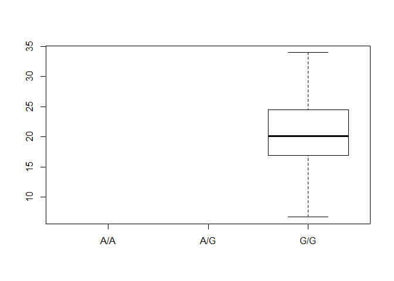

Class13
================
Khoi Tran
May 14, 2019

Reading in the table

``` r
mxl <- read.csv("373531-SampleGenotypes-Homo_sapiens_Variation_Sample_rs8067378.csv")
head(mxl)
```

    ##   Sample..Male.Female.Unknown. Genotype..forward.strand. Population.s.
    ## 1                  NA19648 (F)                       A|A ALL, AMR, MXL
    ## 2                  NA19649 (M)                       G|G ALL, AMR, MXL
    ## 3                  NA19651 (F)                       A|A ALL, AMR, MXL
    ## 4                  NA19652 (M)                       G|G ALL, AMR, MXL
    ## 5                  NA19654 (F)                       G|G ALL, AMR, MXL
    ## 6                  NA19655 (M)                       A|G ALL, AMR, MXL
    ##   Father Mother
    ## 1      -      -
    ## 2      -      -
    ## 3      -      -
    ## 4      -      -
    ## 5      -      -
    ## 6      -      -

How many of each genotype

``` r
table(mxl$Genotype..forward.strand.)
```

    ## 
    ## A|A A|G G|A G|G 
    ##  22  21  12   9

Proportion or percent of total for each genotype

``` r
table(mxl$Genotype..forward.strand.)/nrow(mxl) * 100
```

    ## 
    ##     A|A     A|G     G|A     G|G 
    ## 34.3750 32.8125 18.7500 14.0625

``` r
library(seqinr)
library(gtools)

asc(s2c("DDDDCDEDCDDDDBBDDDCC@"))-34
```

    ##  D  D  D  D  C  D  E  D  C  D  D  D  D  B  B  D  D  D  C  C  @ 
    ## 34 34 34 34 33 34 35 34 33 34 34 34 34 32 32 34 34 34 33 33 30

``` r
datasamples <- read.table("rs8067378_ENSG00000172057.6.txt", row.names = 1)
```

``` r
inds <- datasamples$geno == "G/G"
data2 <-datasamples[inds,]
summary(data2)
```

    ##      sample     geno          exp        
    ##  HG00099:  1   A/A:  0   Min.   : 6.675  
    ##  HG00109:  1   A/G:  0   1st Qu.:16.903  
    ##  HG00112:  1   G/G:121   Median :20.074  
    ##  HG00116:  1             Mean   :20.594  
    ##  HG00118:  1             3rd Qu.:24.457  
    ##  HG00120:  1             Max.   :33.956  
    ##  (Other):115

``` r
boxplot(exp ~ geno, data=data2)
```


