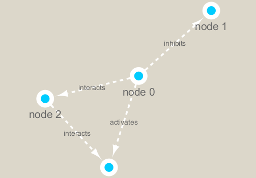

```{r setup, include=FALSE}
knitr::opts_chunk$set(echo = TRUE)
```

```{r}
#Loading Programs
library(RCy3)
library(igraph)
library(RColorBrewer)
library(ggraph)
```

```{r}
#Testing Cytoscape
cytoscapePing()
cytoscapeVersionInfo()
```

```{r}
#Testing
A <- makeSimpleIgraph()
createNetworkFromIgraph(A, "myGraph")
```

```{r}
#Change Network Visual Style
setVisualStyle("Marquee")
```

```{r}
#Makeing and Image
fig <- exportImage(filename="demo", type="png", height=350)

```

```{r}
#What is A
plot(A)
```

```{r}
#Reading in Data
prok_vir_cor <- read.delim("virus_prok_cor_abundant.tsv", stringsAsFactors = FALSE)

#First 6 rows of Data
head(prok_vir_cor)
```

```{r}
#Plotting the Data
g <- graph.data.frame(prok_vir_cor, directed = FALSE)
class(g)
plot(g)
```

```{r}
#Adjusting Plot to Better Visualize
plot(g, vertex.label = NA)

#Decreasing Vertex Size (Normally Set to 15)
plot(g, vertex.size = 3, vertex.label = NA)
```

```{r}
#Showing Relationships
cb <- cluster_edge_betweenness(g)
plot(cb, y=g, vertex.label=NA,  vertex.size=3)
```

```{r}
#Isolation Specific Clusters
head( membership(cb))
```

```{r}
#Finding Plot Degree 
degree <- degree(g)
hist(degree, breaks = 30, col = "green", main = "Node of Degree Distrubution")
plot(degree_distribution(g), type = "h")
```

