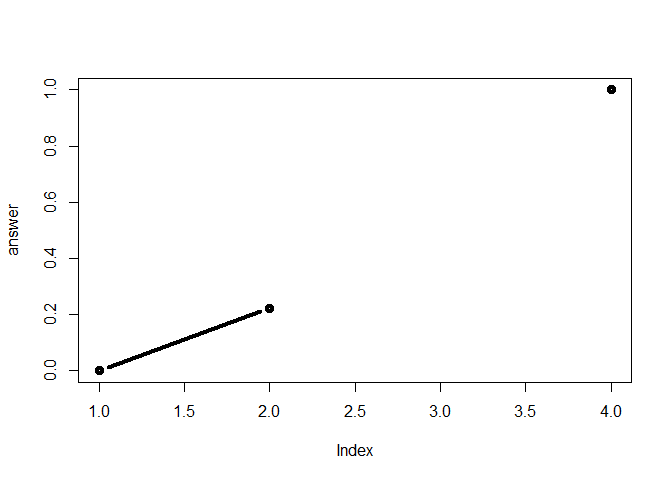

Class 6: R Functions
================
Khoi Tran
April 18, 2019

This is some text

``` r
read.table("Class06_files/test1.txt", header = TRUE, sep = ",")
```

    ##   Col1 Col2 Col3
    ## 1    1    2    3
    ## 2    4    5    6
    ## 3    7    8    9
    ## 4    a    b    c

``` r
read.table("Class06_files/test2.txt", header = TRUE, sep = "$")
```

    ##   Col1 Col2 Col3
    ## 1    1    2    3
    ## 2    4    5    6
    ## 3    7    8    9
    ## 4    a    b    c

``` r
read.table("Class06_files/test3.txt", header = FALSE)
```

    ##   V1 V2 V3
    ## 1  1  6  a
    ## 2  2  7  b
    ## 3  3  8  c
    ## 4  4  9  d
    ## 5  5 10  e

Function
========

``` r
add <- function(x,y=1){
  #the body
  x+y
}
```

``` r
add(9)
```

    ## [1] 10

``` r
add(10,10
    )
```

    ## [1] 20

``` r
add(c(1,2,4),8)
```

    ## [1]  9 10 12

``` r
#add(1,"word") Results in Error
#add(1,1,1) Results in error
```

``` r
rescale <- function(x) {
 rng <-range(x, na.rm = TRUE)
 (x - rng[1]) / (rng[2] - rng[1])
}
```

``` r
rescale(c(1:10))
```

    ##  [1] 0.0000000 0.1111111 0.2222222 0.3333333 0.4444444 0.5555556 0.6666667
    ##  [8] 0.7777778 0.8888889 1.0000000

``` r
rescale(c(1,2,3,NA,4))
```

    ## [1] 0.0000000 0.3333333 0.6666667        NA 1.0000000

``` r
rescale.na.rm.false <- function(x) {
 rng <-range(x, na.rm = FALSE)
 (x - rng[1]) / (rng[2] - rng[1])
}
```

``` r
rescale3 <- function(x, na.rm=TRUE, plot=FALSE) {
 rng <-range(x, na.rm=na.rm)
 print("Hello")
 answer <- (x - rng[1]) / (rng[2] - rng[1])
 print("is it me you are looking for?")
 if(plot) {
 plot(answer, typ="b", lwd=4)
 }
 print("Never stop singing")
 print("I can see it in ...")
 return(answer)
}
```

``` r
rescale3(c(1,3,NA,10))
```

    ## [1] "Hello"
    ## [1] "is it me you are looking for?"
    ## [1] "Never stop singing"
    ## [1] "I can see it in ..."

    ## [1] 0.0000000 0.2222222        NA 1.0000000

``` r
rescale3(c(1,3,NA,10), plot=TRUE)
```

    ## [1] "Hello"
    ## [1] "is it me you are looking for?"



    ## [1] "Never stop singing"
    ## [1] "I can see it in ..."

    ## [1] 0.0000000 0.2222222        NA 1.0000000

``` r
#rescale3 <- function(x, na.rm=TRUE, plot=FALSE) {
#  if(!numeric())
 #rng <-range(x, na.rm=na.rm)
 #print("Hello")
 #answer <- (x - rng[1]) / (rng[2] - rng[1])
 #print("is it me you are looking for?")
 #if(plot) {
 #plot(answer, typ="b", lwd=4)
 #}
 #print("Never stop singing")
 #print("I can see it in ...")
 #return(answer)
```
